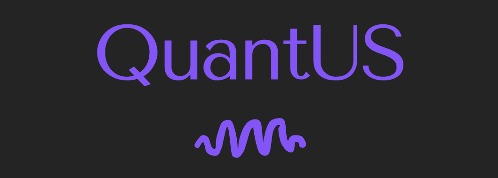

<p align="center">
  
</p>

#

QuantUS is an open-source quantitative analysis tool designed for ultrasonic tissue characterization and contrast enhanced imaging analysis. This software provides an ultrasound system-independent platform for standardized, interactive, and scalable quantitative ultrasound research. QuantUS follows a two-tier architecture that separates core functionality in its backend engines from user interaction support in the frontend. The software is compatible on Mac OS X, Windows, and Linux.

Currently developed backends support quantitative ultrasound (QUS) backscatter analysis and dynamic contrast-enhanced ultrasound (CEUS) perfusion imaging analysis in both 2D and 3D. However, the plugin-based architecture allows for easy extension to additional QUS methods and analysis types in the future.

Note that the GUI in this repository is incomplete. Specifically, the QUS GUI does not support numerical data exporting and the CEUS GUI only supports segmentation. More information about each backend can be found in their respective repositories. Also, support for batch processing is exclusively supported in the backend repositories at this time.

## Installation

To clone this repository, run

```shell
git clone --recurse-submodules https://github.com/TUL-Dev/QuantUS.git
```

To set up the Python virtual environment and install dependencies to run QuantUS, run the following commands. Let `PYTHON311` be the path to your Python3.11 interpreter.

```shell
cd QuantUS
$PYTHON311 -m pip install virtualenv
$PYTHON311 -m virtualenv .venv
source .venv/bin/activate                           # Unix
.venv\Scripts\activate                              # Windows (cmd)
pip install --upgrade pip setuptools wheel
pip install numpy
pip install -r requirements.txt
./saveQt.sh                                         # Unix
.\saveQt.sh                                         # Windows (cmd)
``` 

To run the GUI, use

```shell
source .venv/bin/activate                           # Unix
.venv\Scripts\activate                              # Windows (cmd)
python main.py
```

### Keeping your version up to date

To keep your local copy of all QuantUS backends up to date, run the following commands from the root `QuantUS` directory to update all backends to their latest versions:

```shell
git submodule update --remote --merge
```

## Developer notes

### Remaining things to do for this repository

- [ ] Support plugin inputs from the GUI directly. Since we're using submodules,
        we don't want users copying and pasting files directly into the backend.
        Thus, there should be a new folder `engines/plugins` which can contain all
        plugin-related files and resources. Note each backend will need to be modified
        to look for plugins in this new folder.
- [ ] Test all GUI features to ensure they work as expected.
- [ ] Use Github Actions to automatically update the submodules to their latest versions
        on a regular basis (e.g., weekly, daily, or whenever a commit is completed via webhook).
- [ ] Implement all missing GUI features from Legacy QuantUS. This won't be trivial as
        it will require significant additions to the MVC architecture to support
        more complex interactions.
